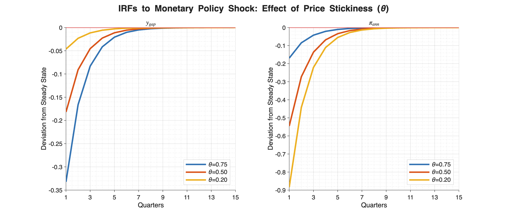
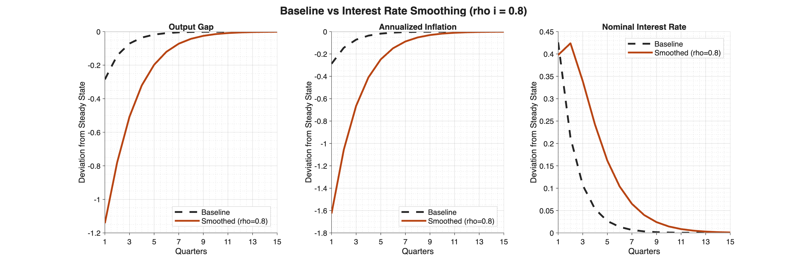
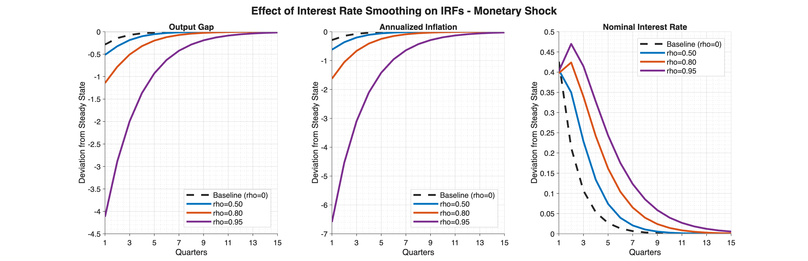
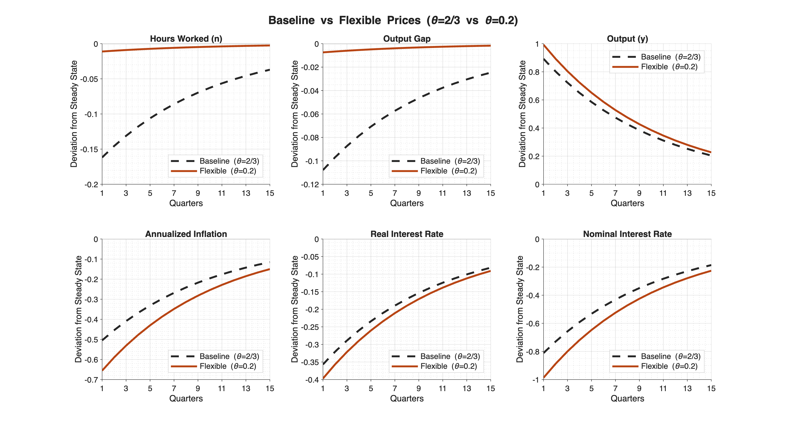

# Monetary Policy Transmission: VAR and DSGE Analysis

Comparing reduced-form (VAR) and structural (rational-expectations) models of U.S. monetary
policy transmission to test whether they imply different dynamics — replicating and extending
the "dynamic inconsistencies" framework of Estrella & Fuhrer (2002) — plus a Dynare companion
model solving the canonical New Keynesian framework these results build on.

**Stack:** Python (`statsmodels`, `SciPy`, `pandas`, `NumPy`) for the VAR/DSGE pipeline ·
Dynare for closed-form rational-expectations solving

## TL;DR

A reduced-form VAR and a micro-founded rational-expectations model can both fit the same
data well while implying *different* dynamics for how output, inflation, and the policy rate
respond to a monetary shock. I estimate both on the same 1966–2000 U.S. sample, solve the
structural model in closed form via the Blanchard-Kahn method, and show where the two
diverge — then extend the structural model with habit formation and a hybrid Phillips curve
to see whether richer micro-foundations close the gap. A companion Dynare model solves the
underlying canonical New Keynesian framework directly and runs three comparative experiments
on price stickiness and policy-rule design.

## Background

Estrella & Fuhrer (2002, *American Economic Review*) show that small New Keynesian models
solved under rational expectations can produce impulse responses that are *dynamically
inconsistent* with the VAR responses estimated from the same data — even when the underlying
parameters are individually plausible. This project replicates that comparison on U.S. data
and extends it with richer model dynamics.

## Data

Quarterly and monthly U.S. macroeconomic series (FRED), 1966 Q1 – 2000 Q4:

| Series | Description |
|---|---|
| `GDPC1` | Real GDP |
| `HOANBS` | Nonfarm business sector hours worked |
| `CLF16OV` | Civilian labor force (monthly, resampled to quarterly) |
| `FDEFX` | Federal government defense expenditure |
| `USAGDPDEFQISMEI` | GDP deflator (→ inflation, log difference) |
| `DFF` | Effective federal funds rate |

Raw data is not included in this repository — see [`data/README.md`](data/README.md).

## Methodology

The notebook is organized in four parts:

1. **Output gap construction** — four alternative output gap measures are built and compared:
   a labor-based gap (deviation of log hours-per-worker from its sample mean), a log-linear
   trend gap (with a structural break), an HP filter gap (λ = 1600), and a Baxter-King
   band-pass filter gap (6–32 quarter cycles). Sample sensitivity is checked across three
   different start dates.
2. **Structural VAR(4)** — a 4-variable VAR (defense spending, inflation, output gap, federal
   funds rate) with a Cholesky-identified ordering, estimated on 1966 Q1–2000 Q4. Confidence
   bands are built via a custom recursive residual bootstrap (500 replications) rather than
   relying on asymptotic approximations.
3. **Rational expectations (DSGE) solution** — the structural model (IS curve + Phillips curve
   + policy rule) is solved in closed form using the Blanchard-Kahn method, and its impulse
   responses are benchmarked directly against the VAR-implied responses to identify where the
   two models disagree on the timing of the output response, the persistence of inflation, and
   the persistence of the policy response itself.
4. **Extended model** — the baseline structural model is extended with habit formation in the
   IS curve and a hybrid (forward + backward-looking) Phillips curve. Parameters are calibrated
   via a grid search against the empirical VAR responses, and robustness is checked via
   subsample re-estimation.

## Dynare Companion: Closed-Form New Keynesian Model

The Python notebook above solves its own custom rational-expectations model by hand via the
Blanchard-Kahn method. As a complementary exercise in the same closed-form-solving tradition —
this time using the standard professional/central-bank toolkit rather than a from-scratch
implementation — `dynare/new_keynesian_model.mod` solves the canonical 3-equation New Keynesian
model from Galí (2008, Ch. 3): a forward-looking NK Phillips curve, a forward-looking dynamic IS
curve, and a smoothed Taylor rule, with the natural rate of interest and natural output pinned
down by an AR(1) technology process.

The model is solved once at baseline and then re-solved across a grid of structural parameters
to run three comparative experiments:

### Experiment 1: Price Stickiness and the Monetary Policy Shock

Comparing the baseline Calvo parameter (θ = 0.66) against a far more flexible-price calibration
(θ = 0.2): under flexible prices, the *same* monetary shock produces a much smaller output gap
response (σ = 0.054 vs. 0.324) and a much larger inflation response (σ = 1.021 vs. 0.344) —
prices absorb the shock instead of quantities, exactly as Calvo-pricing theory predicts. The
chart below shows this monotonically across the full range of θ: the stickier prices are, the
larger and more persistent the output-gap response and the smaller the inflation response.



### Experiment 2: Interest-Rate Smoothing and the Monetary Policy Shock

Comparing ρᵢ = 0 against ρᵢ = 0.8 (baseline θ): smoothing amplifies and prolongs the response to
the same shock substantially — output gap volatility rises from σ = 0.329 to 1.528 (~4.6×),
inflation volatility from σ = 0.332 to 2.112 (~6.4×), and the output gap's first-order
autocorrelation rises from 0.50 to 0.66, i.e. the policy rule itself becomes a source of
persistence and amplification rather than just a stabilizer.



The same pattern holds across the full smoothing range (ρᵢ = 0, 0.5, 0.8, 0.95) — note the
nominal rate itself becomes hump-shaped rather than monotonically decaying once smoothing is
high enough, since the central bank only gradually unwinds its own past rate setting:



### Experiment 3: Price Stickiness and the Technology Shock

Comparing θ = 2/3 against θ = 0.2 for a technology shock: under flexible prices, output and
hours worked move almost entirely with the shock itself (hours-worked volatility falls from
σ = 0.371 to σ = 0.026, ~14× smaller) since the economy sits much closer to its frictionless
allocation, while inflation volatility rises (σ = 1.158 → 1.504).



Across every parameter combination tested (5 explicit stability checks logged), Dynare confirms
the model is determinate — the Blanchard-Kahn rank condition is verified each time, with exactly
3 eigenvalues outside the unit circle matching the model's 3 forward-looking ("jump") variables —
so none of the comparisons above reflect a mis-specified or unstable solution.

See [`dynare/full_run_log.log`](dynare/full_run_log.log) for the complete console output, or
[`dynare/log_excerpt_preprocessing_and_steadystate.txt`](dynare/log_excerpt_preprocessing_and_steadystate.txt)
for just the preprocessing, steady-state, and stability-check output from the baseline run.

## Repository Structure

```
monetary-policy-var-dsge/
├── notebooks/
│   └── var_dsge_analysis.ipynb   # Full pipeline: output gaps → VAR → DSGE → extended model
├── dynare/
│   ├── new_keynesian_model.mod                          # Galí (2008) NK model, 3 experiments
│   ├── full_run_log.log                                  # Complete Dynare console output
│   ├── log_excerpt_preprocessing_and_steadystate.txt     # Just the baseline steady-state/checks
│   └── figures/                                          # IRF plots for all 3 experiments
└── data/
    └── README.md                  # Data sourcing instructions (raw data not included)
```

## Reproducing the Analysis

1. Obtain the data per [`data/README.md`](data/README.md) and place it alongside the notebook.
2. `pip install pandas numpy matplotlib statsmodels scipy openpyxl`
3. Run `notebooks/var_dsge_analysis.ipynb` top to bottom.
4. For the Dynare model: open `dynare/new_keynesian_model.mod` in MATLAB or Octave with
   [Dynare](https://www.dynare.org/) installed and run `dynare new_keynesian_model.mod`. The
   three experiments run automatically in sequence (no manual steps required).

## Skills Demonstrated

Structural VAR estimation and identification, bootstrap inference, closed-form solution of
rational-expectations models both by hand (Blanchard-Kahn, in Python) and in Dynare, DSGE model
extension and calibration via grid search, robustness testing via subsample re-estimation, and
model stability/determinacy diagnostics (rank condition checks).

## Limitations & Possible Extensions

- The Dynare model above solves the canonical Galí (2008) specification, not the project's own
  extended model (habit formation IS curve + hybrid Phillips curve) from Part 4 — it demonstrates
  the same closed-form rational-expectations solving skill set on a standard reference model
  rather than directly cross-checking the Python Blanchard-Kahn solution. Re-implementing the
  *extended* model in Dynare would be the natural next step to get a true side-by-side check.
- The model is calibrated rather than formally estimated (e.g., via Bayesian methods) — a
  full Bayesian DSGE estimation would let the data speak to parameter uncertainty directly.
